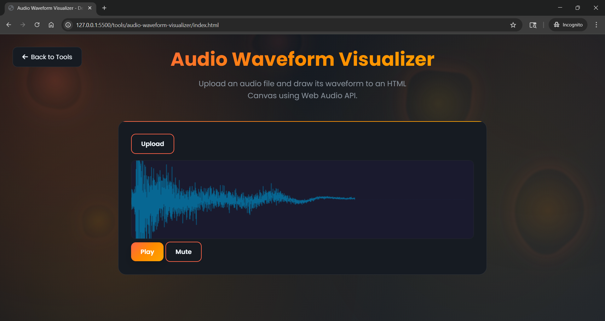
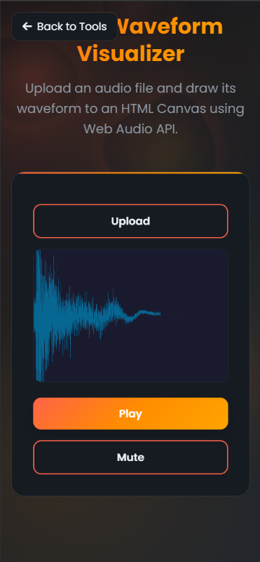
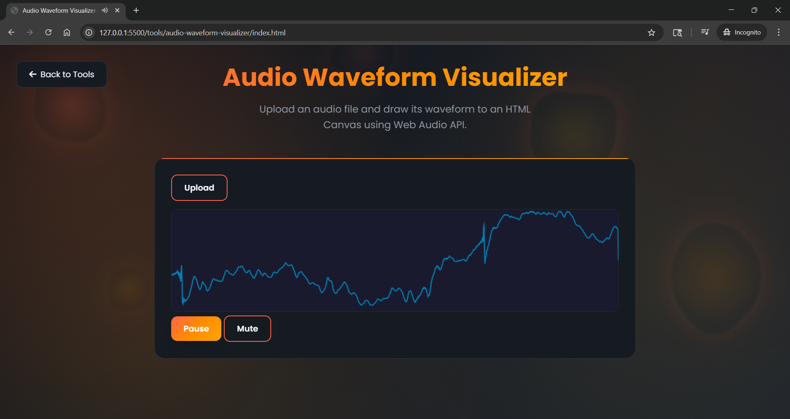

# Audio Waveform Visualization Tool

A web-based tool for analyzing & visualizing audio files by rendering their waveforms to the HTML canvas.

## Instructions
- Upload an audio file and the static waveform will be shown.
- Press play and the dynamic waveform will animate.
- Press pause to pause the audio file.
- Press mute to mute the audio without ending playback.

## Screenshots

### Desktop Interface

### Mobile Responsive Design

### Tool Demonstration

